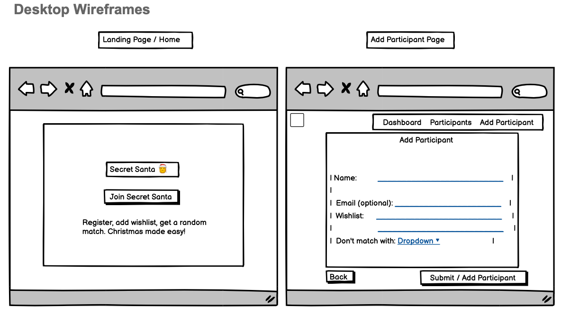
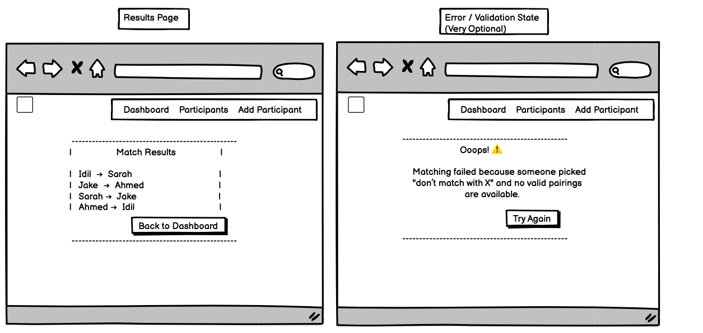
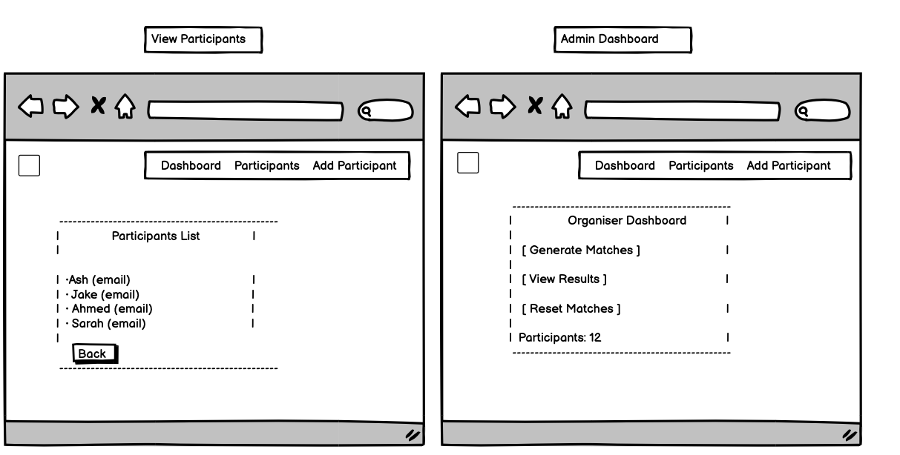
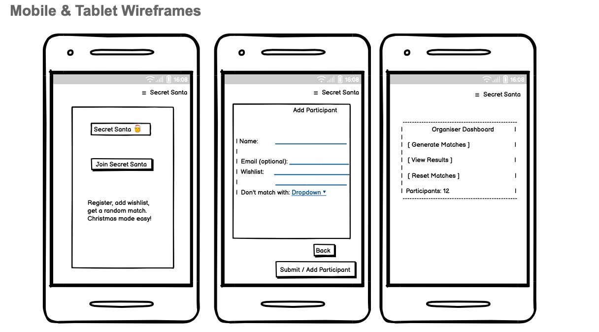
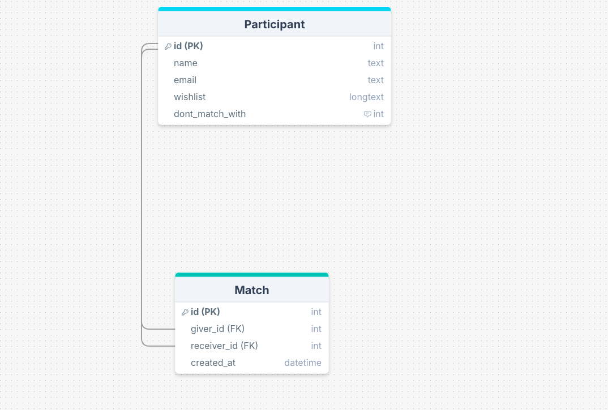

# Git for Christmas

## Project Description

This project is a Django-based web application designed to manage and share Christmas-related content. It includes features such as user authentication, content management, and more.

## Features

- User authentication
- Content management
- Database integration
- Environment variable management

## Technologies Used

This project leverages the following technologies:

- **Python 3.12**: The core programming language used for development.
- **Django 5.2.8**: A high-level Python web framework for rapid development and clean design.
- **SQLite**: A lightweight relational database used for development.
- **Bootstrap 5**: A CSS framework for responsive and modern web design.
- **Font Awesome**: For scalable vector icons and social logos.
- **Git**: Version control system for tracking changes and collaboration.
- **Virtualenv**: For creating isolated Python environments.

These technologies were chosen to ensure scalability, maintainability, and ease of development.

## Setup Instructions

1. **Clone the Repository**

   ```bash
   git clone <repository-url>
   cd git-for-christmas
   ```

2. **Create and Activate a Virtual Environment**

   ```bash
   python3 -m venv venv
   source venv/bin/activate
   ```

3. **Install Dependencies**

   ```bash
   pip install -r requirements.txt
   ```

4. **Set Up Environment Variables**
   Create an `env.py` file in the root directory and add your secrets (e.g., `SECRET_KEY`, `DATABASE_PASSWORD`).

5. **Run Migrations**

   ```bash
   python manage.py migrate
   ```

6. **Run the Development Server**

   ```bash
   python manage.py runserver
   ```

## Wireframes

Below are the wireframes for the project:

### Desktop Wireframes

- **Homepage and Add Participant**
  
- **Results and Error Pages**
  
- **View Participants and Admin Dashboard**
  

### Mobile Wireframe

- **Homepage, Add Participant, and Dashboard**
  

### Tablet Wireframe

- **Homepage, Dashboard, and Add Participant**
  

## Database Schema

The project consists of four main apps: `gifts`, `logs`, `matches`, and `users`. Below is the updated schema for each app:

### Gifts App

| Field            | Type      | Description                                      |
|------------------|-----------|--------------------------------------------------|
| id (PK)          | int       | Unique identifier for each gift                 |
| name             | varchar   | Name of the gift                                |
| description      | text      | Description of the gift                         |
| price            | decimal   | Price of the gift                               |
| created_at       | timestamp | Timestamp of when the gift was added            |

### Logs App

| Field            | Type      | Description                                      |
|------------------|-----------|--------------------------------------------------|
| id (PK)          | int       | Unique identifier for each log entry            |
| message          | text      | Log message                                     |
| level            | varchar   | Log level (e.g., INFO, ERROR)                   |
| created_at       | timestamp | Timestamp of the log entry                      |

### Matches App

| Field            | Type      | Description                                      |
|------------------|-----------|--------------------------------------------------|
| id (PK)          | int       | Unique identifier for each match record         |
| giver_id (FK)    | int       | Participant who gives the gift                  |
| receiver_id (FK) | int       | Participant who receives the gift               |
| created_at       | timestamp | Timestamp of when the match was created         |

### Users App

| Field            | Type      | Description                                      |
|------------------|-----------|--------------------------------------------------|
| id (PK)          | int       | Unique identifier for each user                 |
| username         | varchar   | Username of the user                            |
| email            | varchar   | Email address of the user                       |
| password         | varchar   | Hashed password                                 |
| created_at       | timestamp | Timestamp of when the user was created          |

### Relationships

- `Matches.giver_id → Users.id`
- `Matches.receiver_id → Users.id`
- `Gifts` and `Users` can be linked for wishlist functionality.

### ER Diagram



## Future Enhancements

- Add user roles (e.g., admin, regular user).
- Implement email notifications for matches.
- Add support for multiple Secret Santa groups.
- Improve the UI with more interactive elements.
